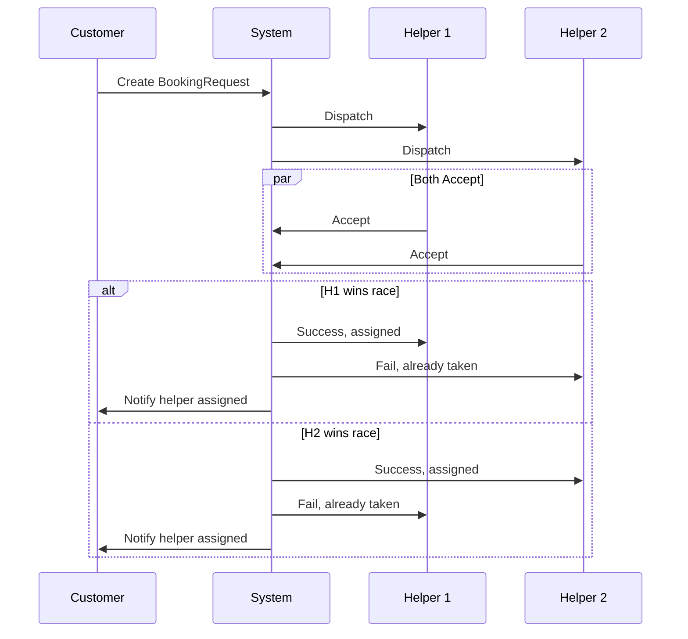

# Double Booking Handling in Zynexx Dispatch System

This document explains how the Zynexx backend prevents and handles double booking scenarios, ensuring that only one helper can accept a booking at a time, even if multiple helpers try to accept simultaneously.

---

## 1. Booking Dispatch to Multiple Helpers
- When a customer creates a booking request, the system dispatches it to multiple eligible helpers at the same time.
- The `BookingRequest` model tracks all helpers the request was sent to using the `dispatchedHelperIds` array.
- All these helpers receive the booking request notification simultaneously.

## 2. Race Condition: Multiple Accepts
- It is possible that two or more helpers try to accept the same booking request at the same time (race condition).
- To prevent double booking, the backend uses a transactional and atomic update when a helper accepts a booking request.

## 3. Atomic Accept Logic (Backend)
- When a helper tries to accept a booking request:
  1. The backend checks if the booking request is still in `PENDING` status and not already accepted by another helper.
  2. The system uses a database transaction (or atomic update with a conditional WHERE clause) to ensure only the first helper to accept can proceed.
  3. If the status is still `PENDING`, the system:
     - Updates the `BookingRequest` status to `ACCEPTED`.
     - Assigns the helper to the request.
     - Creates the actual `Booking` record, linking the customer, service, and assigned helper.
  4. If another helper tries to accept after the status is changed, the update fails, and the backend returns an error (e.g., "Booking already accepted by another helper").

## 4. Database Constraints & Safety
- The system relies on atomic database operations to prevent race conditions.
- No two helpers can be assigned to the same booking request due to the status check and transaction.
- The `Booking` model only allows one assigned helper per booking.

## 5. User Experience
- Only the first helper to accept sees a success message and is assigned the job.
- Other helpers who try to accept after the job is taken receive a message that the booking is no longer available.
- The customer is notified as soon as a helper is assigned.

## 6. Summary Diagram

---

## Key Points
- Multiple helpers can receive and try to accept a booking at the same time.
- Only one can succeed, enforced by atomic backend logic and database transaction.
- No double booking is possible.

For more details, see the BookingRequest accept logic in the backend code and the schema constraints in schema.prisma.
