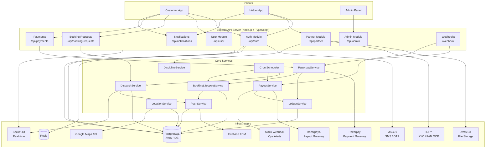
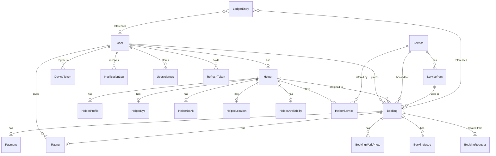

# System Architecture Overview

Zynexx is a marketplace backend connecting **customers** who need home services with **helpers** (service partners) who perform them. The server is a Node.js + Express + TypeScript application backed by PostgreSQL (via Prisma ORM) and a suite of external services. All features are exposed through a REST API with real-time notifications delivered over Socket.IO and Firebase Cloud Messaging.

## Core design principles

| Principle | How it is applied |
|-----------|------------------|
| Role-based modules | Routes are grouped by role: `/api/user`, `/api/partner`, `/api/admin` |
| Immutable audit trail | Ledger entries are INSERT-only; auth events are written to `AuthAudit` |
| Idempotency | Webhook handlers, ledger writes, and payout API calls are idempotent by design |
| Geo-dispatch in Postgres | Haversine distance is computed by a `$queryRaw` query — no separate geo service needed |
| Never crash on optional services | Firebase and Redis failures are caught and logged; the server continues to run |

---

# High-Level Architecture Diagram



---

# Booking Flow Diagram

```mermaid
sequenceDiagram
    participant Customer
    participant API
    participant DispatchSvc
    participant SocketIO
    participant FCM
    participant Helper
    participant RazorpaySvc
    participant LedgerSvc
    participant PayoutSvc

    Customer->>API: POST /api/booking-requests/create\n(serviceId, lat, lng, estimatedHours, ...)
    API->>DispatchSvc: findNearbyHelpers(serviceId, lat, lng)
    DispatchSvc->>API: [helperId list, sorted by distance]
    API->>DispatchSvc: dispatchBookingRequest(requestId, helpers)

    Note over DispatchSvc: Wave 1 (0s) → nearest 3 helpers
    DispatchSvc->>SocketIO: emit booking:new → helper rooms
    DispatchSvc->>FCM: sendPushToHelperIds("New Job Nearby")

    Note over DispatchSvc: Wave 2 (30s) → next 5 helpers (if still PENDING)
    DispatchSvc->>SocketIO: emit booking:new → next wave
    DispatchSvc->>FCM: sendPushToHelperIds(...)

    Note over DispatchSvc: Wave 3 (60s) → next 10 helpers (if still PENDING)
    DispatchSvc->>SocketIO: emit booking:new → next wave
    DispatchSvc->>FCM: sendPushToHelperIds(...)

    Helper->>API: POST /api/booking-requests/:id/accept
    API->>API: Atomic status update PENDING → ACCEPTED\n(race-safe: updateMany with status=PENDING guard)
    API->>SocketIO: emit booking:closed → other dispatched helpers
    API->>API: Create Booking (status: PENDING_PAYMENT)
    API->>FCM: Notify Customer "Helper accepted"

    Customer->>API: POST /api/payments/create-order
    API->>RazorpaySvc: createRazorpayOrder(bookingId)
    RazorpaySvc->>Razorpay: POST /v1/orders
    Razorpay-->>RazorpaySvc: orderId
    RazorpaySvc-->>Customer: orderId, amount, keyId

    Customer->>Razorpay: Complete checkout (client-side)
    Razorpay->>API: POST /webhook/razorpay (payment.captured)
    API->>RazorpaySvc: verifyHMAC + handleCapture
    RazorpaySvc->>API: Update Payment CAPTURED, Escrow LOCKED
    RazorpaySvc->>LedgerSvc: createLedgerEntry(PAYMENT_CAPTURED, CREDIT)
    RazorpaySvc->>LedgerSvc: createLedgerEntry(ESCROW_LOCK, DEBIT)
    RazorpaySvc->>API: confirmBooking → CONFIRMED + OTP generated
    API->>FCM: Notify Customer + Helper "Payment received, booking confirmed"

    Helper->>API: POST /api/partner/bookings/:id/before-photos
    Helper->>API: POST /api/partner/bookings/:id/start-timer
    Helper->>API: POST /api/partner/bookings/:id/start (body: otp)
    API->>API: Verify OTP → status CONFIRMED → IN_PROGRESS

    Helper->>API: POST /api/partner/bookings/:id/after-photos
    Helper->>API: POST /api/partner/bookings/:id/complete
    API->>API: status → COMPLETED; commissionSnapshot frozen
    API->>LedgerSvc: createLedgerEntry(COMMISSION_EARNED, CREDIT)
    API->>FCM: Notify Customer "Job completed"

    Note over PayoutSvc: Cron every 5 min: payoutEligibleAt (2 hr hold) reached
    PayoutSvc->>RazorpayX: payout to helper's fund_account_id (IMPS)
    PayoutSvc->>LedgerSvc: createLedgerEntry(HELPER_PAYOUT, DEBIT)
    PayoutSvc->>API: Update Booking.payoutStatus = PAID
```

---

# Dispatch System Flow

The dispatch system finds available helpers near a customer's location and notifies them in ordered **staggered waves**.

## 1. Booking Request Creation

`POST /api/booking-requests/create` is handled by `booking-dispatch.service.ts`. A `BookingRequest` record is created with `status = PENDING` and an expiry timestamp.

## 2. Helper Filtering — Geo Search

`dispatch.service.ts → findNearbyHelpers()` runs a **Haversine distance query entirely inside PostgreSQL** using `$queryRaw`:

```sql
SELECT h.id AS helperId, hl.latitude, hl.longitude,
       6371 * acos(cos(radians(lat)) * cos(radians(hl.latitude))
         * cos(radians(hl.longitude) - radians(lng))
         + sin(radians(lat)) * sin(radians(hl.latitude))) AS distance
FROM Helper h
JOIN HelperService hs ON hs.helperId = h.id  -- must serve this serviceId
JOIN HelperLocation hl ON hl.helperId = h.id  -- live GPS location
WHERE hs.serviceId = $1
  AND h.isAvailable = true
  AND h.onboardingStatus = 'APPROVED'
  AND distance < 5 km
ORDER BY distance ASC
LIMIT 20
```

Filters applied: service match, `isAvailable=true`, `APPROVED` onboarding status, within **5 km**.

## 3. Staggered Dispatch Waves

Up to 20 helpers are retrieved and split across three time-delayed waves:

| Wave | Delay | Helpers |
|------|-------|---------|
| Wave 1 | `0 ms` (immediate) | Nearest 3 |
| Wave 2 | `30 000 ms` | Next 5 |
| Wave 3 | `60 000 ms` | Next 10 |

Before each wave fires, the system re-checks `BookingRequest.status`. If it is no longer `PENDING` (already accepted or cancelled) the wave is silently skipped.

## 4. Notification Sending

Each wave triggers two parallel channels:
- **Socket.IO** (`emitToHelpers`) — sends `booking:new` to each helper's room (`helper:<id>`) for instant in-app display.
- **Firebase FCM** (`sendPushToHelperIds`) — sends a push notification for helpers whose app is backgrounded or the device is locked.

## 5. Accept / Reject Logic

- **Accept**: `POST /api/booking-requests/:requestId/accept` — uses an atomic `updateMany` with `WHERE status = 'PENDING'` guard. The first helper to hit this wins; subsequent calls get a `409`. All other dispatched helpers receive a `booking:closed` socket event.
- **Reject**: helper records a rejection reason. The dispatch system continues with remaining waves.
- **Expiry**: A cron job runs every **5 seconds** calling `processExpiredRequests()`. Any `BookingRequest` past its `expiresAt` is set to `EXPIRED` and a `booking:expired` socket event is emitted.

## 6. Discipline Tracking

`helper-discipline.service.ts` records every ignored request, rejection, no-show, and cancellation on the `Helper` record. Suspension thresholds trigger automatic `suspendedUntil` timestamps:

| Violation | Threshold | Window | Suspension |
|-----------|-----------|--------|------------|
| No-show | 2 events | 7 days | 48 hours |
| Cancellation | 3 events | 7 days | 24 hours |
| Penalty | 3 events | 30 days | 72 hours |
| Ignore | 3 events | 24 hours | 2 hours |

---

# Payment and Ledger Flow

## Payment Order Creation

1. Customer calls `POST /api/payments/create-order`.
2. `razorpay.service.ts` fetches the `Booking` (must be `PENDING_PAYMENT`), calls the Razorpay Orders REST API (`POST https://api.razorpay.com/v1/orders`), and saves the returned `orderId` to the `Payment.transactionId` field — idempotent (only writes if `transactionId` is still null).
3. Returns `{ orderId, amount, keyId }` to the client for checkout.

## Payment Capture (Webhook)

1. Razorpay calls `POST /webhook/razorpay` with a raw body + `X-Razorpay-Signature` header.
2. Backend verifies **HMAC-SHA256** signature (`crypto.timingSafeEqual`) against `RAZORPAY_WEBHOOK_SECRET`.
3. On `payment.captured` event:
   - `Payment.status` → `CAPTURED`; `Payment.escrowStatus` → `LOCKED`
   - Two **ledger entries** are written atomically:
     - `PAYMENT_CAPTURED | CREDIT | grossAmount`
     - `ESCROW_LOCK | DEBIT | grossAmount`
   - `confirmBooking()` is called: `Booking.status` → `CONFIRMED`, a 4-digit start OTP is generated.
4. On `payment.failed`: event is logged, booking stays `PENDING_PAYMENT`.

## Commission Calculation

When a booking is **completed** (`POST /api/partner/bookings/:id/complete`):
- `commissionRate` is read from `PlatformSetting.commissionRate` at that moment and **frozen** into `Booking.commissionRateSnapshot` — future admin changes never affect settled bookings.
- Computed fields saved:
  - `platformCommissionAmount = totalAmount × commissionRate`
  - `helperPayoutAmount = totalAmount − platformCommissionAmount`
- `payoutEligibleAt = completedAt + 2 hours` (hold period for dispute window).
- Ledger entry: `COMMISSION_EARNED | CREDIT`.

## Helper Payout

A cron job runs every **5 minutes** calling `processPendingPayouts()` from `payout.service.ts`:

1. Finds all `Booking` rows with `payoutStatus = PENDING` and `payoutEligibleAt <= NOW`.
2. Requires `Helper.payoutEnabled = true` and a valid `HelperBank.razorpayFundAccountId`.
3. Calls the **RazorpayX** payout API (`razorpay.payouts.create`) using `bookingId` as the idempotency key.
4. Uses **exponential backoff** on transient failures (attempt 1 → +10 min, attempt 2 → +1 hr, attempt 3 → +6 hr). After `MAX_RETRIES = 3` permanent failures → `FAILED` + Slack alert.
5. On success:
   - `Booking.payoutStatus` → `PAID`; `Payment.escrowStatus` → `RELEASED`
   - Ledger entry: `HELPER_PAYOUT | DEBIT`

## Refund Flow

- `POST /api/payments/:paymentId/refund` (Admin only) calls the Razorpay Refunds API.
- `Payment.status` → `REFUNDED`; `Payment.escrowStatus` → `REFUNDED`
- Ledger entry: `REFUND_ISSUED | DEBIT`
- Webhook `payment.refunded` can confirm the status.

## Ledger Entry Types

| Type | Direction | When written |
|------|-----------|-------------|
| `PAYMENT_CAPTURED` | CREDIT | Razorpay webhook: payment captured |
| `ESCROW_LOCK` | DEBIT | Same as above — funds enter escrow |
| `COMMISSION_EARNED` | CREDIT | Booking completed |
| `HELPER_PAYOUT` | DEBIT | RazorpayX payout initiated |
| `REFUND_ISSUED` | DEBIT | Refund approved |
| `PAYOUT_REVERSAL` | CREDIT | Admin cancels after payout |

The `LedgerEntry` table is **INSERT-only** (never updated or deleted). A unique constraint on `(type, referenceId)` provides database-level idempotency safe for webhook retries.

---

# Database Model Overview

> All models use PostgreSQL via Prisma ORM. Timestamps are stored as `TIMESTAMPTZ(3)` (UTC).

## Core Models

### `User`
Central identity record. Every person — customer, helper, admin — has exactly one `User` row.

| Key fields | Notes |
|------------|-------|
| `phone` | Unique, primary identifier for auth |
| `role` | `CUSTOMER` \| `HELPER` \| `ADMIN` |
| `isBlocked` / `blockedReason` | Admin block |
| `suspendedUntil` | Auto-suspension from discipline system |

Relations: `Helper?`, `Booking[]`, `Rating[]`, `DeviceToken[]`, `NotificationLog[]`, `UserAddress[]`, `RefreshToken[]`

---

### `Helper`
Extended profile for service partners. One-to-one with `User`.

| Key fields | Notes |
|------------|-------|
| `onboardingStatus` | `PENDING_KYC` → `PENDING_APPROVAL` → `APPROVED` / `REJECTED` |
| `isAvailable` / `isOnline` | Operational state |
| `payoutEnabled` / `payoutSetupStatus` | RazorpayX registration status |
| `ignoreCount`, `noShowCount`, `cancelCount`, `strikeCount` | Discipline counters |

Sub-records: `HelperProfile`, `HelperKyc`, `HelperBank`, `HelperLocation`, `HelperAvailability`, `HelperService[]`

---

### `BookingRequest`
Transient dispatch record — created when a customer submits a job request, destroyed (via status change) once accepted/expired.

| Key fields | Notes |
|------------|-------|
| `status` | `PENDING` / `ACCEPTED` / `REJECTED` / `CANCELLED` / `EXPIRED` |
| `dispatchedHelperIds` | Array of helpers notified so far |
| `expiresAt` | Polled every 5 seconds by cron |
| `latitude` / `longitude` | Used for Haversine geo-dispatch |

---

### `Booking`
The core transactional record for a confirmed job.

| Key fields | Notes |
|------------|-------|
| `status` | `PENDING_PAYMENT` → `CONFIRMED` → `IN_PROGRESS` → `COMPLETED` / `CANCELLED` / `NO_SHOW` |
| `startOtp` / `otpGeneratedAt` / `otpAttempts` | OTP-based job start |
| `jobTimerStarted` / `jobStartedAt` | After before-photos are uploaded |
| `totalAmount`, `platformFee`, `finalAmount` | Financials |
| `commissionRateSnapshot`, `platformCommissionAmount`, `helperPayoutAmount` | Frozen at completion |
| `payoutStatus` | `PENDING` / `PROCESSING` / `PAID` / `FAILED` |
| `escrowStatus` (via Payment) | `PENDING` → `LOCKED` → `RELEASED` / `REFUNDED` |

---

### `Payment`
One-to-one with `Booking`. Tracks the Razorpay transaction.

| Key fields | Notes |
|------------|-------|
| `razorpayOrderId`, `razorpayPaymentId` | Razorpay identifiers |
| `status` | `CREATED` → `CAPTURED` / `FAILED` / `REFUNDED` |
| `escrowStatus` | `PENDING` → `LOCKED` → `RELEASED` / `REFUNDED` |

---

### `LedgerEntry`
Immutable double-entry financial audit log. Never updated or deleted.

| Key fields | Notes |
|------------|-------|
| `type` | See Ledger Entry Types table above |
| `direction` | `CREDIT` or `DEBIT` |
| `amount` | `Decimal(14,2)` |
| `referenceId` | Unique per type — idempotency key |

---

### `HelperLocation`
Live GPS coordinates of a helper. One-to-one with `Helper`, `upsert`-ed on every location update.

---

### `HelperKyc`
Image KYC records with IDFY PAN verification results (`panNumber`, `verificationStatus`, `nameMatchScore`, `idfyRawResponse`).

---

### `HelperBank`
Bank account details for payouts. Stores `razorpayFundAccountId` once the RazorpayX contact + fund account is registered.

---

### `DeviceToken`
FCM device push tokens. One `User` → many `DeviceToken` rows (multi-device). Stale tokens are auto-pruned after FCM returns `registration-token-not-registered`.

---

### `NotificationLog`
Audit log for every push notification sent. Used to render in-app notification history (`GET /api/notifications`).

---

### `AuthAudit`
Append-only security log: `OTP_SENT`, `OTP_FAILED`, `OTP_VERIFIED`, `LOGIN_SUCCESS`, `TOKEN_REFRESH`, `LOGOUT`, `LOCKED_OUT`.

---

### `OtpSecurity`
Per-phone OTP rate-limiting state: `failedAttempts`, `lockedUntil`, `resendCount`. Enforced before forwarding requests to MSG91.

---

## Entity-Relationship Summary



---

# Admin System

All admin routes are under `/api/admin` and require `JWT + ADMIN` role.

## Users Management (`/api/admin/users`)
- List all customers with filters (active / blocked), pagination, and search by name/phone.
- View full profile with booking stats (total, completed, cancelled, total spent) and 10 most recent bookings.
- Block / unblock a user with an audit reason.

## Helpers Management (`/api/admin/helpers`)
- List helpers with `status` filter (active/inactive), search, pagination.
- View full helper profile including services offered, earnings breakdown, and recent bookings.
- Change operational status (`active` / `inactive`) — can disable a helper independently of the discipline system.

## Onboarding (`/api/admin/onboarding`)
- Approve or reject a helper's onboarding application. On approval, `onboardingStatus → APPROVED`; helper becomes eligible for dispatch.

## Bookings Management (`/api/admin/bookings`)
- Paginated booking list with stats cards (total, active now, pending, completed).
- Full booking detail including work photos, customer/helper profiles, payment info, and any reported issues.
- Admin override cancellation — cancels regardless of status. If payment was captured, initiates refund. If payout was already paid, sets `payoutReversalRequired: true`.

## Finance Dashboard (`/api/admin/finance`)
- `GET /summary` — all figures derived from `LedgerEntry` (not raw booking fields): total revenue, total commission, total helper payouts, total refunds, net revenue.
- `GET /payouts` — paginated payout history with status filter.
- `GET /payouts/:bookingId` — per-booking payout audit trail.

## Payout Management (`/api/admin/payout`)
- `POST /payout/:bookingId/mark-paid` — manual payout confirmation for offline/bank-transfer scenarios.

## Services & Plans (`/api/admin/services`, `/api/admin/service-plans`)
- Full CRUD for `Service` and `ServicePlan` catalogue entries offered to customers.

## Platform Settings (`/api/admin/settings`)
- Get/update platform commission rate (`PlatformSetting.commissionRate`).
- Patch other platform-wide config (cancellation fee percent, booking hour limits, feature flags).

---

# External Integrations

## Razorpay — Payment Gateway
**Service files:** `razorpay.service.ts`, `core/razorpay.routes.ts`

Used for customer-facing payments:
- **Orders API** (`POST /v1/orders`) — creates a Razorpay order, amount in paise.
- **Webhook** (`POST /webhook/razorpay`) — receives `payment.captured` and `payment.failed` events. Verified via HMAC-SHA256 using `RAZORPAY_WEBHOOK_SECRET`.
- Signature verification in `crypto.timingSafeEqual` to prevent timing attacks.

## RazorpayX — Payout Gateway
**Service files:** `payout.service.ts`, `webhooks/razorpayx.routes.ts`, `razorpay.contact.service.ts`

Used for helper payouts:
- **Contacts API** — creates a Razorpay contact for each helper during onboarding.
- **Fund Accounts API** — registers a helper's bank account under their contact to get a `fund_account_id`.
- **Payouts API** (`razorpay.payouts.create`) — initiates IMPS transfer to the helper using `fund_account_id`. Uses `bookingId` as idempotency key.
- **Webhook** (`POST /webhook/razorpayx`) — receives payout status events.
- Failed registrations are retried via a cron job every 30 minutes (`payout.registration.retry.service.ts`).

## Firebase Cloud Messaging — Push Notifications
**Service files:** `firebase.service.ts`, `push.service.ts`

Used to send push notifications to mobile/web clients:
- Initialised once at startup via `initializeFirebase()` using `FIREBASE_PROJECT_ID`, `FIREBASE_CLIENT_EMAIL`, `FIREBASE_PRIVATE_KEY`.
- `push.service.ts` looks up all `DeviceToken` rows for a user, sends an FCM multicast, auto-prunes dead tokens.
- Every sent notification is persisted to `NotificationLog` for the in-app history API.
- Notification types include: `BOOKING_NEW` (dispatch), `BOOKING_CONFIRMED`, `JOB_STARTED`, `JOB_COMPLETED`, and admin alerts.

## MSG91 — OTP / SMS
**Service files:** `otp.service.ts`, `otp-security.service.ts`

Used as the sole identity verification channel:
- Calls the MSG91 Flow API (`https://control.msg91.com/api/v5/otp`) to generate and deliver OTPs. The backend never generates or stores the OTP value itself.
- `OtpSecurity` table enforces per-phone rate limits (failed attempts, resend cooldowns, lockout windows) before forwarding requests to MSG91.
- All OTP events are written to `AuthAudit`.

## AWS S3 — File Storage
**Config:** `AWS_REGION`, `AWS_ACCESS_KEY_ID`, `AWS_SECRET_ACCESS_KEY`, `AWS_S3_BUCKET`

Used for blob storage of:
- **KYC documents** — selfie, PAN card image, police verification document (uploaded during partner onboarding).
- **Work photos** — before-job and after-job photos uploaded by helpers per booking (stored in `BookingWorkPhoto`).
- **Profile photos** — user avatar uploads.
- Files are uploaded via Multer (multipart) and stored with pre-signed S3 URLs.

## IDFY — Identity Verification (KYC / PAN OCR)
**Service file:** `idfy.service.ts`

Used for automated PAN card verification during partner KYC Step 2:
- Accepts a PAN card image, sends it to the IDFY OCR endpoint (`https://eve.idfy.com/v3`).
- Returns extracted PAN number, name on card, and a match score vs the helper's declared full name.
- Raw IDFY response is stored in `HelperKyc.idfyRawResponse` for audit.
- `HelperKyc.verificationStatus` transitions: `PENDING` → `IN_PROGRESS` → `VERIFIED` / `REVIEW` / `FAILED`.

## Google Maps API — Location & Routing
**Service file:** `location.service.ts`

Used for real-time location features:
- Route calculation between helper location and customer address.
- Display of helper's ETA on the customer app during an active booking.
- Geocoding for address resolution.
- Config via `GOOGLE_MAPS_API_KEY` (environment variable).

## Redis — Rate Limiting & Token Management
**Service file:** `redis.service.ts`

Used for:
- OTP rate limiting (shared state for distributed deployments).
- Token blacklist (`token-blacklist.service.ts`) for invalidating refresh tokens on logout.
- General API rate limiting via `express-rate-limit` with Redis store.
- The server gracefully degrades to in-memory limiting if Redis is unavailable.

## Slack — Operational Alerts
**Service file:** `alert.service.ts`

Used for critical backend alerts:
- `PAYOUT_FAILED` — individual helper payout permanently failed after 3 retries.
- `PAYOUT_STUCK` — a payout has been in `PROCESSING` status for > 12 hours.
- `FUND_REGISTRATION_FAILED` — RazorpayX contact/fund-account registration exhausted retries.
- `FINANCE_MISMATCH` — ledger integrity check detected discrepancy.
- `BOOKING_ISSUE_REPORTED` — helper reported a problem on an active booking.
- Optional: only fires when `SLACK_WEBHOOK_URL` env var is set.

---

# Important Services

## `dispatch.service.ts`
The core matching engine. `findNearbyHelpers()` runs a Haversine SQL query to identify candidates sorted by proximity. `dispatchBookingRequest()` orchestrates the three-wave rollout using `setTimeout`, aborting early if the request is no longer `PENDING`.

## `booking-dispatch.service.ts`
Orchestration layer on top of `dispatch.service.ts`. Handles `BookingRequest` creation, acceptance race resolution, rejection, request expiry (`processExpiredRequests`), and payment expiry (`processPaymentExpirations`). Applies `recordIgnore` to helpers who did not respond within their acceptance window.

## `booking-lifecycle.service.ts`
State machine for `Booking`. Manages:
- `confirmBooking` — `PENDING_PAYMENT → CONFIRMED` + OTP generation (race-safe).
- `startBooking` — OTP verification + `CONFIRMED → IN_PROGRESS`.
- `completeBooking` — commission snapshot, payout eligibility timestamp, `IN_PROGRESS → COMPLETED`.
- `cancelBooking` — handles `CUSTOMER` / `HELPER` / `SYSTEM` cancellation sources, triggers discipline recording.
- `autoCancelInactiveConfirmedBookings` — polled every 5 minutes; cancels bookings stuck in `CONFIRMED` state for > 30 minutes.

## `razorpay.service.ts`
Wraps Razorpay REST API calls:
- `createRazorpayOrder` — idempotent order creation.
- `verifyPaymentSignature` — HMAC validation for webhook and client-side verification.
- `handlePaymentCaptured` — atomic Prisma transaction: update `Payment` + write two `LedgerEntry` rows + call `confirmBooking`.
- `initiateRefund` — calls Razorpay Refunds API, updates payment + ledger.

## `payout.service.ts`
Manages helper payouts via RazorpayX:
- `processPendingPayouts` — batch-processes eligible `Booking` rows, calls `initiateRazorpayPayout`, handles retries.
- Exponential backoff schedule: 10 min → 1 hr → 6 hr → FAILED.
- `isTransientError()` classifies network/5xx errors as retryable vs permanent.
- On failure: fires Slack alert via `alert.service.ts`.

## `ledger.service.ts`
Single function `createLedgerEntry()` that accepts an optional Prisma transaction client. Amount is validated > 0, converted to `Decimal(14,2)`. Duplicate entries (same `type + referenceId`) are silently swallowed via Prisma P2002 — safe for webhook double-delivery.

## `push.service.ts`
Four public functions: `sendPushNotification(userId)`, `sendPushToMany(userIds)`, `sendPushToRole(role)`, `sendPushToHelperIds(helperIds)`. All use FCM multicast, prune dead tokens post-send, and write to `NotificationLog`. Never throws.

## `location.service.ts`
Updates `HelperLocation` via `upsert` on every GPS ping from the partner app. Provides `getRouteForBooking()` which queries both helper and customer coordinates, calls Google Maps Directions API, and returns route + ETA polyline. Supports helper range-check relative to customer coordinates.

## `helper-discipline.service.ts`
`recordNoShow`, `recordCancellation`, `recordIgnore`, `recordPenalty` — each atomically increments the relevant counter on `Helper` and checks thresholds within rolling time windows to apply `User.suspendedUntil`.

## `finance.ledger.service.ts`
`getLedgerSummary()` — aggregates `LedgerEntry` by type to produce `{ totalRevenue, totalCommission, totalHelperPayout, totalRefunds, netRevenue }`. All admin finance dashboard figures are sourced exclusively from this table, not from raw booking/payment fields.

---

# Cron Scheduler Overview

All cron jobs are registered in `src/tasks/expiry-cronjob.ts` and `src/cron/payout.cron.ts` at startup.

| Schedule | Task | Purpose |
|----------|------|---------|
| Every 5 seconds | `processExpiredRequests()` | Expire stale `BookingRequest` rows, emit `booking:expired` |
| Every 5 seconds | `processPaymentExpirations()` | Cancel unpaid bookings past `paymentExpiresAt` |
| Every 5 minutes | `processPendingPayouts()` | Trigger RazorpayX payouts for eligible bookings |
| Every 5 minutes | `autoCancelInactiveConfirmedBookings()` | Cancel CONFIRMED bookings stuck > 30 min |
| Every 5 minutes | `autoCancelStaleInProgressBookings()` | Cancel IN_PROGRESS bookings past 8-hour timeout |
| Every 5 minutes | `autoCancelNoShowBookings()` | Cancel bookings where helper never started |
| Every 30 minutes | `retryFailedFundRegistrations()` | Retry Razorpay contact/fund-account setup for helpers |
| Daily at 03:00 | `reconcilePayouts()` | Cross-check payout records against RazorpayX; fix mismatches |

---

# End-to-End System Flow

The complete lifecycle from customer intent to helper payout:

```
1. CUSTOMER REGISTERS / LOGS IN
   └─ POST /api/auth/login → MSG91 sends OTP
   └─ POST /api/auth/verify-otp → JWT access + refresh token issued
   └─ RefreshToken hash stored in DB; token blacklisted on logout

2. CUSTOMER CREATES BOOKING REQUEST
   └─ POST /api/booking-requests/create
   └─ Validation (service exists, lat/lng valid, address, hours)
   └─ BookingRequest record created (status = PENDING)
   └─ dispatchBookingRequest() → Haversine geo query in Postgres
   └─ Wave 1 (0s): push + socket to 3 nearest helpers
   └─ Wave 2 (30s): push + socket to next 5 helpers (if still PENDING)
   └─ Wave 3 (60s): push + socket to next 10 helpers (if still PENDING)
   └─ Fallback: if no accept after 60s + waves, request → EXPIRED (5s cron)

3. HELPER ACCEPTS
   └─ Socket event booking:new triggers in-app alert
   └─ POST /api/booking-requests/:id/accept
   └─ Atomic updateMany(WHERE status = PENDING) — race-safe
   └─ BookingRequest → ACCEPTED; Booking created (status = PENDING_PAYMENT)
   └─ Other dispatched helpers receive booking:closed socket event

4. CUSTOMER PAYS
   └─ POST /api/payments/create-order → Razorpay order created
   └─ Client completes Razorpay checkout
   └─ Razorpay → POST /webhook/razorpay (payment.captured)
   └─ HMAC-SHA256 signature verified
   └─ Payment → CAPTURED; Escrow → LOCKED
   └─ LedgerEntry: PAYMENT_CAPTURED (CREDIT) + ESCROW_LOCK (DEBIT)
   └─ Booking → CONFIRMED; 4-digit start OTP generated
   └─ FCM push to customer + helper: "Booking confirmed"

5. HELPER PERFORMS JOB
   └─ Helper arrives; uploads before-photos (POST .../before-photos → S3)
   └─ POST .../start-timer — job timer recorded
   └─ Customer shows OTP in app
   └─ POST .../start { otp: "XXXX" } → OTP verified → Booking IN_PROGRESS
   └─ Helper performs work
   └─ Helper uploads after-photos (POST .../after-photos → S3)
   └─ POST .../complete → Booking COMPLETED
       └─ commissionRateSnapshot frozen from PlatformSetting
       └─ platformCommissionAmount + helperPayoutAmount computed & stored
       └─ payoutEligibleAt = now + 2 hours
       └─ LedgerEntry: COMMISSION_EARNED (CREDIT)
   └─ FCM push to customer: "Job completed"

6. CUSTOMER RATES
   └─ POST /api/ratings → Rating record created
   └─ Helper.rating + totalRatings aggregated

7. HELPER PAYOUT (automated)
   └─ Cron every 5 min: finds COMPLETED bookings with payoutEligibleAt <= now
   └─ RazorpayX payout initiated to helper's fund_account_id (IMPS)
   └─ LedgerEntry: HELPER_PAYOUT (DEBIT)
   └─ Booking.payoutStatus → PAID; Payment.escrowStatus → RELEASED
   └─ On failure: exponential backoff retry; after 3 failures → FAILED + Slack alert

8. FINANCE RECONCILIATION
   └─ Daily at 03:00: reconcilePayouts() cross-checks every PAID/PROCESSING row
   └─ Admin dashboard /api/admin/finance/summary reads exclusively from LedgerEntry
```

---

*Generated from source analysis of all modules, services, schema, and cron jobs in `/src`. Last updated: March 2026.*
